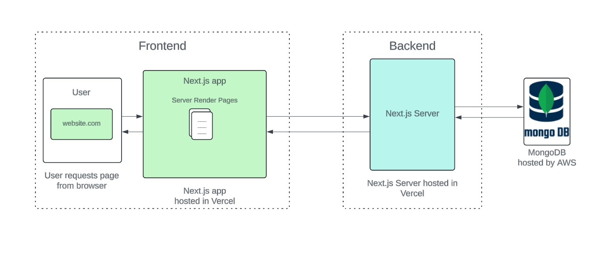

# Speiseplan-Projekt

## Einleitung

Willkommen zum **Speiseplan-Projekt**. Diese Anwendung wurde mit **React, TypeScript, Next.js und Tailwind CSS** entwickelt und verwendet **MongoDB** zur speicherung der Daten. Die Anwendung dient der Verwaltung und Bestellung von Speiseplänen und beinhaltet die Nutzung von Mitarbeitern und Administratoren über eine intuitive Benutzeroberfläche.

## Setup

Um das Projekt lokal zu starten, folge diesen Schritten:

1. Installiere alle notwendigen Abhängigkeiten:
   ```bash
   npm install
   ```
2. Starte die Entwicklungsumgebung:
   ```bash
   npm run dev
   ```
3. Die Anwendung wird dann unter `http://localhost:3000` lokal verfügbar sein.

## Architektur

Das Projekt basiert auf der folgenden Architektur:




## Projektstruktur

Die Projektstruktur ist wie folgt organisiert:

### 1. API-Routen

Die API-Routen befinden sich im Verzeichnis `src/app/api`. Jede Datei repräsentiert eine Route, die HTTP-Anfragen entgegennimmt und verarbeitet.

- Beispiel: Die Route `src/app/api/createMeal/route.js` verarbeitet eine POST-Anfrage zur Erstellung einer neuen Mahlzeit und validiert die Daten, bevor sie in die MongoDB-Datenbank gespeichert wird.

### 2. Seiten (Pages)

Alle Seiten befinden sich im Verzeichnis `src/app`. Jede Datei und jeder Ordner entspricht einer Seite der Anwendung.

- Wichtige Seiten: `login`, `register`, `profile`, `speiseplan`, `admin`.
- `layout.tsx`: Definiert das allgemeine Layout der Anwendung (z.B. Header und Footer).
- `page.tsx`: Die Hauptseite der Anwendung.

### 3. Bibliotheken (Lib)

Im Verzeichnis `src/lib` befinden sich wiederverwendbare Hilfsfunktionen und Services.

- Beispiele: 
  - `mongodb.js`: Hilfsfunktionen zur Interaktion mit der MongoDB-Datenbank.
  - `validationHelpers.js`: Funktionen zur Validierung von Benutzereingaben.

### 4. Komponenten

Wiederverwendbare UI-Komponenten befinden sich im Verzeichnis `src/components`.

- Beispiele: 
  - `Navbar.jsx`: Die Navigationsleiste.
  - `Footer.jsx`: Der Footer, der auf jeder Seite angezeigt wird.
  - `CreateMealModal.tsx`: Ein Modal zur Erstellung neuer Mahlzeiten.

### 5. Modelle (Models)

Die Datenmodelle, die die Struktur der in MongoDB gespeicherten Daten definieren, befinden sich in `src/models`.

- Beispiele: 
  - `meals.js`: Modell für Mahlzeiten.
  - `users.js`: Modell für Benutzer.

### 6. Tests

Die Tests für die LIB befinden sich im Ordner `src/lib/libTests`. Alle anderen Tests befinden sich im selben Verzeichnis der zu testenden Datei.

- Beispiel: `mongodb.test.js` testet die Interaktionen mit der MongoDB-Datenbank.

## Coding & Branching Guidelines

### Coding Guidelines

- **Benennungen**: Verwende `CamelCase` für Variablen- und Funktionsnamen.
- **Kommentare**: Der Code und die Kommentare sind auf Englisch zu schreiben.
- **Funktionsstruktur**: Jede Funktion sollte kommentiert sein und wie folgt strukturiert sein:

```js
/**
 * Multipliziert zwei Zahlen
 */
function multiply(a, b) {
    return a * b;
}
```

Wichtige Codezeilen sollten wie folgt kommentiert sein:

```js
let result = square(crossProduct(3 % 2)); // Berechnet das Quadrat des Kreuzprodukts
```

### Branching Guidelines

- Jede **User Story** hat einen oder mehrere Branches.
- Ein Branch sollte wie folgt benannt sein: `32-FeatureName`.
- Branches werden per Pull Request (PR) auf den `Dev-Branch` gemerged. Ein erfolgreiches Review ist erforderlich.
- Auf den **Main-Branch** wird am Ende des Sprints gemerged, wenn mindestens zwei Reviews vorhanden sind.

## Team

Das Entwicklungsteam besteht aus folgenden Full-Stack-Entwicklern:

- Jonas P.
- Julian S.
- Laurin S.
- Simon W.
